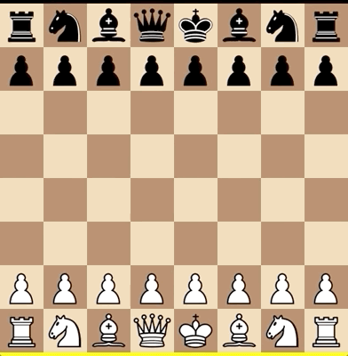

# _Chesses_ Press Kit

_Your pieces slide! Your pieces fall! Your pieces do the strangest things! It's chesses unlike the chess you normally chess! Bet you can't chess just one!_

#### [Play _Chesses_](https://pippinbarr.github.io/chesses) (Desktop and Mobile)

## The basics

* Developer: [Pippin Barr](http://www.pippinbarr.com/)
* Release: ? ? 2019
* Platform: Browser (desktop and mobile)
* Code repository: https://github.com/pippinbarr/chesses
* Price: $0.00

## Who is this Pippin Barr guy?

Pippin is an experimental game developer who has made games about everything from [Eurovision](http://www.pippinbarr.com/2012/03/27/epic-sax-game/) to [performance art](http://www.pippinbarr.com/2011/09/14/the-artist-is-present/) to [dystopian post-work futures](http://www.pippinbarr.com/games/2017/07/03/it-is-as-if-you-were-doing-work.html). He's an Assistant Professor in the [Department of Design and Computation Arts](http://www.concordia.ca/finearts/design.html) at [Concordia University](http://www.concordia.ca/) in Montréal. He is also the associate director of the [Technoculture, Art, and Games (TAG)](http://tag.hexagram.ca/) Research Centre, which is part of the [Milieux Institute for Arts, Culture, and Technology](http://milieux.concordia.ca/).

## Description

_Chesses_ is more or less a continuation of the kind of game design I've pursued with games like [PONGS](https://www.pippinbarr.com/2012/04/11/pongs/), [BREAKSOUT](https://www.pippinbarr.com/2015/10/01/breaksout/), and [SNAKISMS](https://www.pippinbarr.com/2017/01/25/snakisms/), among others. That is, it's a set of variations on an original game: in this case it's chess. There are eight variations in the collection (one for each rank on a chessboard or something), each exploring some addition to or subtraction from the original game of chess, whether it's playing with gravity applied or playing quantum moves that exercise every option at once. Unsurprisingly you can't really play any of these variations as you would play standard chess, but that's kind of the fun of it - a chance to play some chess without freaking out about the obscene difficulty it represents.

## History

_Chesses_ essentially arose from my interest quite a while ago (like in 2014) in "gravity chess", which would be played with the board rotated 90 degrees such that when you play a piece out into space it falls to the bottom. In fact, I worked on this for a little while with [Tom Curtis](https://dinosaursandmoustaches.com/), but we ran out of steam somewhere along the way (he was doing all the work, to be fair) and it didn't materialise. Now that I'm a better programmer than I was, and pretty comfortable with chess programming in JavaScript thanks to previous projects ([Let's Play: Ancient Greek Punishment: Chess Edition](https://www.pippinbarr.com/games/2019/04/23/lets-play-ancient-greek-punishment-chess-edition.html) and [Rogess](https://www.pippinbarr.com/games/2019/05/21/rogess.html)), I figured I could make a move on it.

I went through a larger set of ideas for chess variants that might be interesting specifically played via a computer (rather than just playing on a chess board), and of course culled some (fare thee well, Mirror Chess, Swaps Chess, and Pawn Chess). Mostly I tried to end up with a set that I think are genuinely somewhat interesting to play - both just to try to understand how to do anything sensible, and then beyond that to try to play "well" in the new version.

_Chesses_ is also another data-point in the ultra-detailed process documentation approach called [MDMA](http://www.gamesasresearch.com/mdma). So, if you want to, you can read a lot about the game's development by reading its [process documentation](https://github.com/pippinbarr/chesses/blob/master/process/README.md), by going through its [commit history](https://github.com/pippinbarr/chesses/commits/master), and by reading the [research questions](https://github.com/pippinbarr/chesses/blob/master/process/research-questions.md).

## Technology

_Chesses_ was created in JavaScript using the ever-so-useful [chess.js](https://github.com/jhlywa/chess.js) and [chessboard.js](https://chessboardjs.com/) libraries which together make representing chess (or variants) remarkably straightforward compared to the true nightmare it would be to do from scratch. It also involved a little bit of [jQuery](https://jquery.com/) and [jQuery UI](https://jqueryui.com/).

## License

_Chesses_ is an open source game licensed under a [Creative Commons Attribution-NonCommercial 3.0 Unported License](http://creativecommons.org/licenses/by-nc/3.0/). You can obtain the source code from its [code repository](https://github.com/pippinbarr/chesses) on GitHub.

## Features

- Chess!
- But also not really chess!
- Sliding!
- Falling!
- Quantum superpositions!

### Trailer

See animated GIFs.

## Images

  
Gravity Chess

  
Momentum Chess

  
Gambling Chess

## Press

- Coming soon?

## Additional Links

- [Process documentation of _Chesses_](https://github.com/pippinbarr/chesses/blob/master/process/README.md)
- [Commit history of _Chesses_](https://github.com/pippinbarr/chesses/commits/master)

## Credits

* Pippin Barr: basically everything?

## Contact

* Email: [pippin.barr+press@gmail.com](mailto:pippin.barr+press@gmail.com)
* Website: [www.pippinbarr.com](http://www.pippinbarr.com/)
* Twitter: [@pippinbarr](https://www.twitter.com/pippinbarr)
* Instagram: [@pippinbarr](https://www.instagram.com/pippinbarr)
* Facebook: [Pippin Barr](http://www.facebook.com/pippin.barr)
